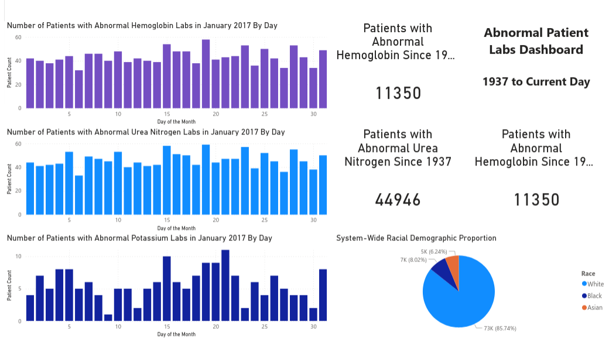

# FHIR EHR Data Pipeline & Analytics Dashboard

An end-to-end healthcare data engineering pipeline that transforms raw FHIR-formatted electronic health record (EHR) data into a structured SQLite database and Power BI dashboard.

This project automates the extraction, normalization, storage, and visualization of clinical data — significantly reducing manual data processing time.

---

## Project Overview

Healthcare data in FHIR (Fast Healthcare Interoperability Resources) format is deeply nested and complex. This project builds a complete pipeline that:

1. Parses raw FHIR JSON bundles  
2. Extracts key clinical entities  
3. Normalizes data using NumPy  
4. Stores structured data in SQLite  
5. Creates SQL-ready schemas for reporting  
6. Connects to Power BI via ODBC for dashboard visualization  
7. Automates the entire workflow using Python  

---

## Architecture

Raw FHIR JSON Files
↓
Python + NumPy Preprocessing
↓
Structured .npy Files
↓
SQLite Database (ehr.db)
↓
SQL Views & Queries
↓
Power BI Dashboard (via ODBC)

---

## Tech Stack

- **Python**
- **NumPy** – data structuring and preprocessing
- **SQLite** – relational database storage
- **SQL** – reporting views & queries
- **Power BI** – interactive dashboard visualization
- **ODBC** – database connectivity

---

## Extracted FHIR Resources

The pipeline extracts and structures the following FHIR resource types:

- **Patient**
- **Condition**
- **MedicationRequest**
- **Observation**
- **DiagnosticReport**

---

## 🗄 PowerBI Dashboard

The dashboard displays patient counts and histories surrounding abnormal urea nitrogen, hemoglobin, and potassium labs. While just an example, this could potentially tell hospital providers which patients are in need of special care during their stay.

## 🗄 Database Schema

### `patient`
| Column | Type |
|--------|------|
| patient_id | TEXT (PK) |
| name | TEXT |
| birth_date | TEXT |
| race | TEXT |
| ethnicity | TEXT |
| marital_status | TEXT |
| address | TEXT |

---

### `conditions`
| Column | Type |
|--------|------|
| condition_id | TEXT (PK) |
| patient_id | TEXT |
| encounter_id | TEXT |
| code | TEXT |
| description | TEXT |

---

### `observations`
| Column | Type |
|--------|------|
| obs_id | TEXT |
| patient_id | TEXT |
| encounter_id | TEXT |
| code | TEXT |
| value | REAL |
| unit | TEXT |
| interpretation | TEXT |
| effective_datetime | TEXT |

---

### `medication`
| Column | Type |
|--------|------|
| encounter_id | TEXT |
| patient_id | TEXT |
| code | TEXT |
| description | TEXT |

---

### `report`
| Column | Type |
|--------|------|
| report_id | TEXT (PK) |
| patient_id | TEXT |
| encounter_id | TEXT |
| report_code | TEXT |
| report_name | TEXT |
| lab_name | TEXT |
| results | TEXT |
| date_issued | TEXT |

---

## Key Features

### ✅ FHIR Parsing & Normalization
- Walks directory of FHIR JSON bundles
- Extracts nested extensions (race, ethnicity)
- Standardizes observation values
- Handles missing/null fields safely

### ✅ NumPy-Based Intermediate Storage
- Converts parsed resources into structured `.npy` arrays
- Improves performance before database insertion

### ✅ Automated SQLite Build
- Drops and recreates tables automatically
- Bulk inserts using `executemany()` for efficiency
- Fully reproducible database generation

### ✅ Business Intelligence Integration
- SQLite connected to Power BI via ODBC
- Created reporting views for:
  - Lab trends
  - Condition prevalence
  - Medication distribution
  - Patient demographics

No manual processing required.

---

